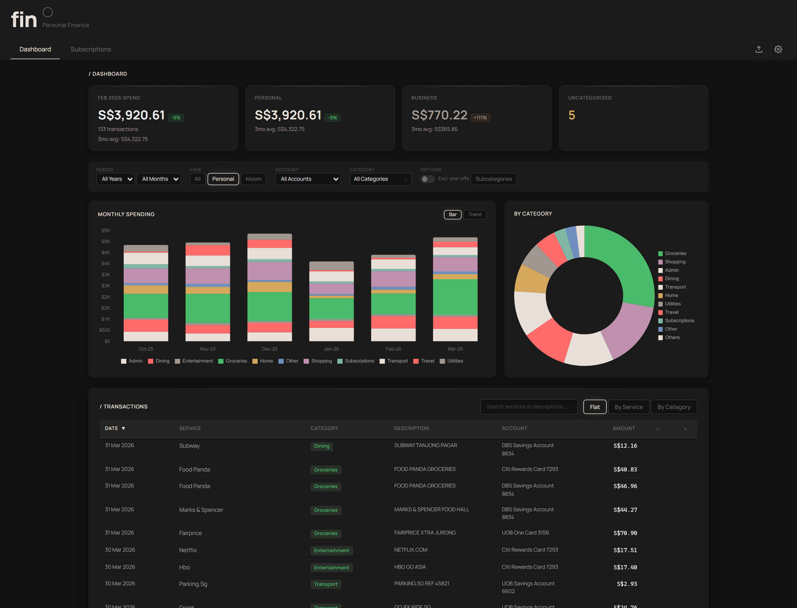
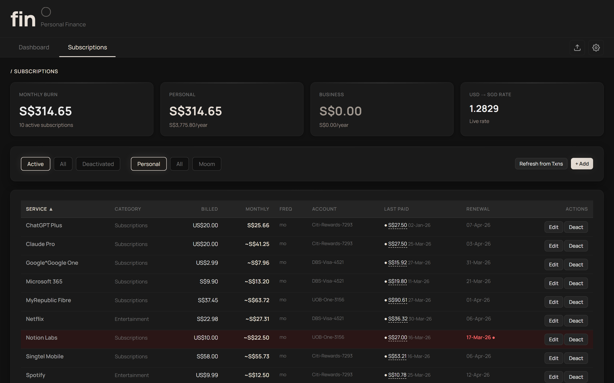
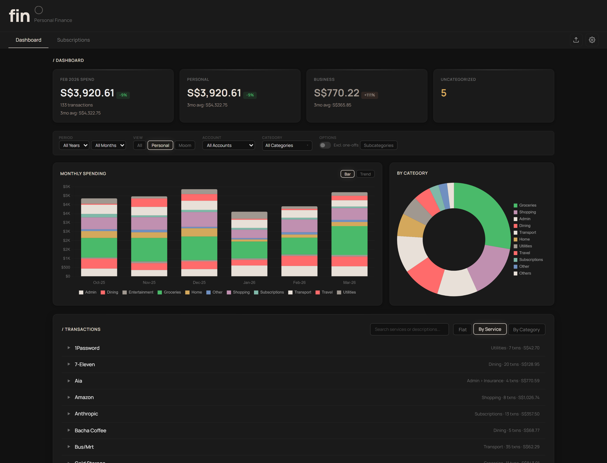
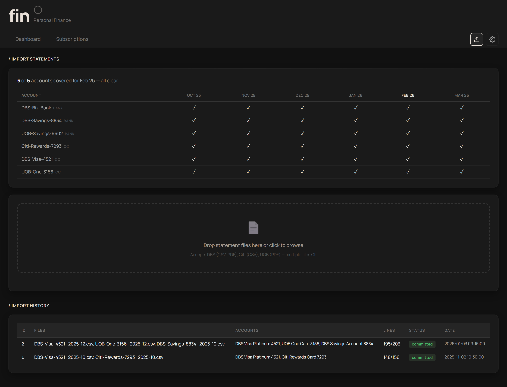
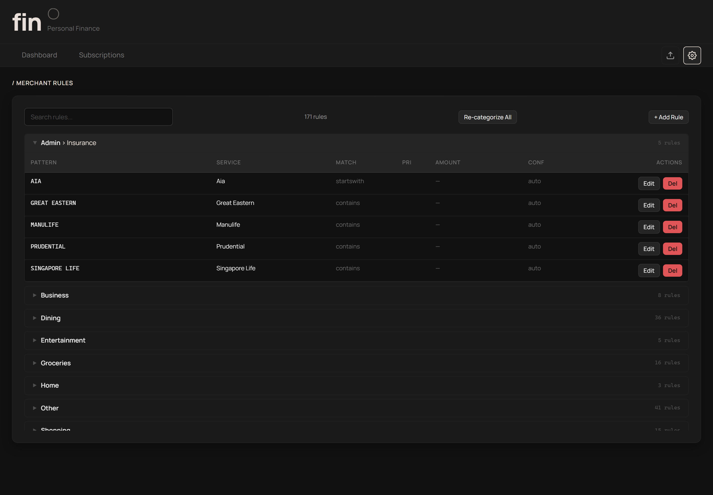

# fin

Personal finance tracker for Singapore bank statements. Import CSV/PDF statements from DBS, Citi, and UOB, auto-categorize transactions via a pattern-matching rules engine, and visualize spending through interactive charts and dashboards.



## Features

**Statement Import**
- Drag-and-drop multi-file upload with auto-detection of bank and format
- Supports DBS (CSV + PDF), Citi (CSV), UOB (PDF)
- Interactive preview with per-transaction service/category overrides before committing
- Duplicate detection across imports
- Statement coverage matrix showing which accounts have data for each month

**Dashboard**
- Monthly stacked bar chart and category donut with interactive multi-select filtering
- Stat cards with 3-month rolling averages and delta indicators
- Three transaction views: flat table, by-service accordion, by-category accordion
- Unified filter bar: period, personal/business, account, category, one-off exclusion
- Full-text search across services, descriptions, and categories

**Service-Centric Data Model**
- Services are the central entity (Netflix, Grab, FairPrice) linking rules, transactions, and subscriptions
- Merchant rules map statement descriptions to services via pattern matching (contains/startswith/exact)
- Category flows through the chain: `description -> rule -> service -> category`
- Resolve Modal: one-step flow to categorize unknown transactions, create services, and set up rules

**Subscription Tracking**
- Track recurring charges with amount, currency (SGD/USD), billing frequency, and renewal dates
- Auto-enrichment from transaction history (last paid, rolling average)
- Monthly burn calculation with personal/business split
- Renewal-soon highlighting

**Masters**
- Categories: hierarchical taxonomy with parent/child relationships
- Services: CRUD with merge, bulk rename, cleanup tools
- Rules: pattern-based merchant matching with priority and amount thresholds
- Accounts: bank account and credit card management with archive/restore

## Screenshots

<details>
<summary>Subscriptions</summary>


</details>

<details>
<summary>By Service View</summary>


</details>

<details>
<summary>Import Statements</summary>


</details>

<details>
<summary>Merchant Rules</summary>


</details>

## Quick Start

```bash
git clone https://github.com/bharat2288/fin.git
cd fin
pip install flask pdfplumber openpyxl
python seed_mock_data.py
python app.py
```

Open [http://localhost:8450](http://localhost:8450). The seed script creates a demo database with 6 months of fictional transactions, 10 subscriptions, and sample merchant rules.

## Architecture

```
Statement Files (CSV, PDF)
        |
        v
[Frontend SPA]                          [Flask Backend]
 Dashboard tab                           /api/dashboard/*   -- stat cards, charts
   Flat | By Service | By Category       /api/transactions  -- paginated list + resolve
 Subscriptions tab                       /api/subscriptions -- CRUD + enrichment
 Import (icon)                           /api/import/*      -- upload, parse, confirm
 Masters (dropdown)                      /api/services/*    -- CRUD + merge
   Categories | Services | Rules         /api/rules/*       -- pattern CRUD + recat
   Accounts                              /api/accounts      -- CRUD
        |                                       |
        v                                       v
[Chart.js]                              [Parser Registry]
 Stacked bar + donut                     parse_dbs.py      (PDF)
 Multi-select interaction                parse_dbs_csv.py   (CSV)
                                         parse_citi_csv.py  (CSV)
                                         parse_uob.py       (PDF)
                                                |
                                                v
                                        [SQLite — fin.db]
                                         8 tables: transactions, services,
                                         merchant_rules, categories,
                                         subscriptions, accounts,
                                         statements, batch_imports
```

## Data Model

The service-centric model means a single resolution step connects everything:

```
Bank Statement Description
  "STARBUCKS RAFFLES PLACE"
        |
        v
Merchant Rule (pattern match)
  pattern: "STARBUCKS"
  match_type: contains
        |
        v
Service
  name: "Starbucks"
  category: Dining
        |
        v
Transaction categorized
  + rule remembered for future imports
```

### Key Tables

| Table | Purpose |
|-------|---------|
| `transactions` | Every imported expense with date, amount, description, category, service |
| `services` | What you pay for (Netflix, Grab, etc.) — links rules to categories |
| `merchant_rules` | Pattern -> service mapping with priority and amount thresholds |
| `categories` | Hierarchical spending taxonomy (Groceries, Dining, Transport, ...) |
| `subscriptions` | Recurring charges with frequency, renewal tracking, enrichment |
| `accounts` | Bank accounts and credit cards (DBS, Citi, UOB) |
| `statements` | Per-month import records per account |
| `batch_imports` | Import session metadata |

## Adding a Bank Parser

Each bank has its own parser registered via the parser registry pattern:

```python
# parsers.py
from parsers import register

@register("mybank_csv")
def parse_mybank(filepath: str) -> list[dict]:
    # Parse the file and return transaction dicts
    return [
        {
            "date": "2025-01-15",
            "description": "MERCHANT NAME",
            "amount_sgd": 42.50,
            "card_info": "MyBank Card 1234",
        }
    ]
```

The import endpoint auto-detects format from file contents. Add detection logic in `parsers.py` for new formats.

## Tech Stack

- **Backend**: Python 3.11+, Flask
- **Frontend**: Vanilla JavaScript (no framework), Chart.js
- **Database**: SQLite (single file, zero config)
- **PDF Parsing**: pdfplumber
- **Design**: Dark Neutral theme with custom design tokens

## Development

```bash
# Run with debug mode
python app.py --debug

# Run on a different port
python app.py --port 9000

# Re-seed mock data (deletes existing database)
rm fin.db
python seed_mock_data.py
```

## Limitations

- Single-user, runs locally (no authentication)
- PDF parsing depends on statement format consistency
- No real-time bank connections — manual statement import only
- SGD primary currency (foreign transactions tracked at statement FX rate)

## License

MIT
